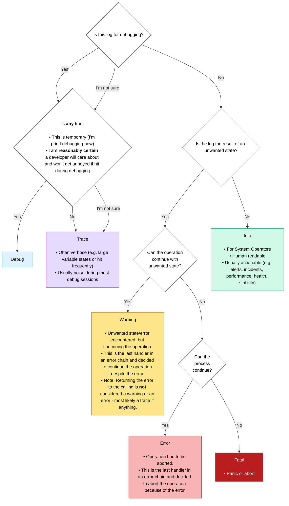

# err_trail

[](https://github.com/mcmah309/err_trail)
[](https://crates.io/crates/err_trail)
[](https://docs.rs/err_trail)
[](https://github.com/mcmah309/err_trail/actions/workflows/ci.yml)

A generic logging interface for libraries and binaries. Libraries remain generic and binaries pick the logging implementation(s). 

Current backends enabled by feature flags: 
- [tracing](https://crates.io/crates/tracing)
- [log](https://crates.io/crates/log)
- [defmt](https://crates.io/crates/defmt) (no_std).

If no backend is selected by the binary, since all operations are inlined, they get compiled away during compilation. No overhead or downstream lock-in. Libraries can also easily enable logs for tests only.

Convenience methods are also added on `Result` and `Option` for ergonomic logging when an `Err` or `None` is encountered. No need to `match` or `inspect`. Similar to how context is handled in libraries like [eros](https://github.com/mcmah309/eros) or [anyhow](https://github.com/dtolnay/anyhow) while moving up the call stack, but for logging.


## In Action

All methods and macros work with the generic backends. Like previously mentioned, if no backend is selected they are compiled away.

### Macros

Familiar `error!`, `warn!`, `info!`, `debug!`, `trace!` macros exist to log in a way similar to the built in rust `format!` macro.

```rust
use err_trail::{error, warn, info, debug, trace};

fn main() {
    error!("An error occurred: {}", "disk full");
    warn!("This is a warning: {}", "high memory usage");
    info!("Some info: {}", "service started");
    debug!("Debugging value: {:?}", vec![1, 2, 3]);
    trace!("Trace log: {}", "function entered");
}
```

### New Result and Option methods

New methods are added to `Result` and `Option` types - `error`, `warn`, `info`, `debug`, `trace`. These apply logs are various log levels

```rust
use err_trail::ErrContext;

fn main() {
    let value: Result<(), String> = result().error("If `Err`, this message is logged as error");
    let value: Result<(), String> = result().warn("If `Err`, this message is logged as warn");
    // Notice these methods can also accept closures for lazy evaluation
    let value: Result<(), String> = result().error(|err: &String| format!("If `Err`, this message is logged as error: {}", err));
    // If the error type implements `Display` then `()` can be passed to log the error directly if `Err`
    let value: Result<(), String> = result().error(());
}
fn result() -> Result<(), String> { Ok(()) }
```

The same methods exist for `Option` too.

> Note: Due to some limitations of Rust's type inferencing on closures, for closures, usually the input type needs to be specified - e.g. `: &String`.

## Guide

Opinionated guide on how to log if you are new to logging or would like a refresher:



## no_std

This crate supports `#![no_std]`.