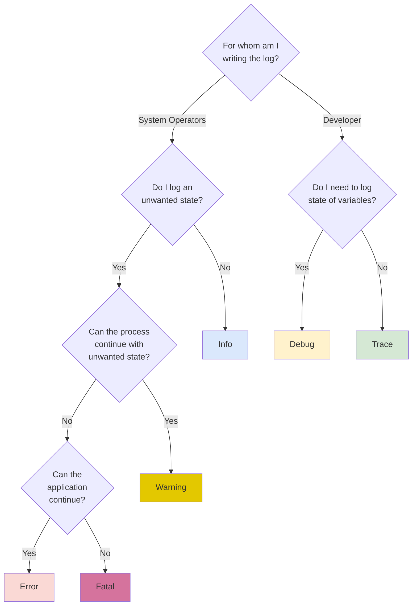

# err_trail

[](https://github.com/mcmah309/err_trail)
[](https://crates.io/crates/err_trail)
[](https://docs.rs/err_trail)
[](https://github.com/mcmah309/err_trail/actions/workflows/ci.yml)

Convience methods on `Result` and `Option` for logging when an `Err` or `None` is ecountered. Similar to [eros](https://github.com/mcmah309/eros) and [anyhow](https://github.com/dtolnay/anyhow)
but for logging.

## Feature Flags

**tracing** / **log** / **defmt** :
Enables support for the `tracing` or `log` or `defmt` crates. `error`, `warn`, `info`, `debug`, and `trace` methods are added to `Result` and are executed when the `Result` is an `Err` for logging purposes. They work similarly to `eros`'s and `anyhow`'s `.context(..)` method. e.g.
```rust
use err_trail::{ErrContext, ErrContextDisplay};

fn main() {
    let value: Result<(), String> = result().error("If `Err`, this message is logged as error via tracing/log/defmt");
    let value: Result<(), String> = result().warn("If `Err`, this message is logged as warn via tracing/log/defmt");
    let value: Result<(), String> = result().with_error(|err| format!("If `Err`, this message is logged as error via tracing/log/defmt: {}", err));
    let value: Option<()> = result().ok_error(); // If `Err`, the `Err` is logged as error via tracing/log/defmt
    let value: Option<()> = result().with_warn(|err| format!("If `Err`, this message is logged as warn via tracing/log/defmt: {}", err)).ok();
    // ...etc.
}

fn result() -> Result<(), String> { Ok(()) }
```
This is useful tracing context around errors. e.g.
```rust
use err_trail::{ErrContext, ErrContextDisplay};

fn main() {
    let val: Result<(), String> = result().warn("`func` failed, here is some extra context like variable values");
    let val: Option<()> = result().ok_warn();
}

fn result() -> Result<(), String> { Ok(()) }
```
rather than
```rust
fn main() {
    let val: Result<(), String> = result().inspect_err(|err| tracing::warn!("`func` failed, here is some extra context like variable values"));
    let val: Option<()> = result().inspect_err(|err| tracing::warn!("{}", err)).ok();
}

fn result() -> Result<(), String> { Ok(()) }
```
## Notes For Libraries

This api is perfect for libraries. Downstream binaries ultimately decide the implementation for which logging provider to use, if any. If no implementations is selected, since all the above methods are inlined, the code becomes a no-op and will be optimized away during compilation.

## Guide

Deciding which log level to use can be tedious. Here is an opinionated guide:



- Are you consuming an error (Likely from a `Result<T,E>`)?
    - Yes: you should use `error`
    - No: Next
- 

**Additional Notes**
- If returning a `Result`, context should usually be `warn`.
- If consuming a `Result`, context should usually be `error`.
- `error` can also be used over `warn` for cases that should not be possible, but handling is preferred over panic in production.

## no_std

This crate supports `#![no_std]`.