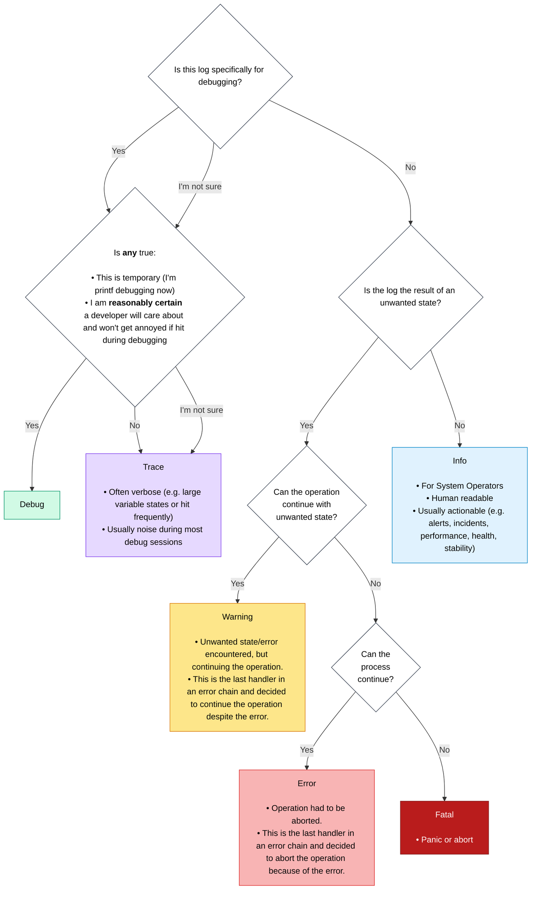

# err_trail

[](https://github.com/mcmah309/err_trail)
[](https://crates.io/crates/err_trail)
[](https://docs.rs/err_trail)
[](https://github.com/mcmah309/err_trail/actions/workflows/ci.yml)

A generic logging interface for libraries and binaries. Libraries remain generic and binaries pick the logging implementation(s). 

Current backends enabled by feature flags: 
- [tracing](https://crates.io/crates/tracing)
- [log](https://crates.io/crates/log)
- [defmt](https://crates.io/crates/defmt) (no_std).

If no backend is selected by the binary, since all operations are inlined, they get compiled away during compilation. No overhead or downstream lock-in. Libraries can also easily enable logs for tests only.

Convenience methods are also added on `Result` and `Option` for ergonomic logging when an `Err` or `None` is encountered. No need to `match` or `inspect`. Similar to how context is handled in libraries like [eros](https://github.com/mcmah309/eros) or [anyhow](https://github.com/dtolnay/anyhow) while moving up the call stack, but for logging.


## In Action

All methods and macros work with the generic backends. Like previously mentioned, if no backend is selected they are compiled away.

### Macros

The `trace!`, `debug!`, `info!`, `warn!`, and `error!` macros use **tracing's
message and field syntax**, including `%` and `?`, across the `tracing`, `log`,
and `defmt` backends.

```rust
use err_trail::{debug, error, info, trace, warn};

let endpoint = "https://api.example.com";
let retry_delays_ms = [100, 200, 400];

trace!(attempt = 1, "Preparing request");
debug!(?retry_delays_ms, "Configured retries");
info!("Connecting to {endpoint}");
warn!(attempt = 1, "Request timed out; retrying");
error!(%endpoint, attempts = 4, "Request failed after exhausting retries");
```

See [Macro syntax](#macro-syntax) for examples and supported syntax.

### New Result and Option methods

New methods are added to `Result` and `Option` types - `error`, `warn`, `info`, `debug`, `trace`. These apply logs are various log levels

```rust
use err_trail::ErrContext;

fn main() {
    let value: Result<(), String> = result().error("If `Err`, this message is logged as error");
    let value: Result<(), String> = result().warn("If `Err`, this message is logged as warn");
    // Closures provide lazy evaluation; use `|err: &_|` to infer the error type
    let value: Result<(), String> = result().error(|err: &_| format!("If `Err`, this message is logged as error: {}", err));
    // If the error type implements `Display` then `()` can be passed to log the error directly if `Err`
    let value: Result<(), String> = result().error(());
}
fn result() -> Result<(), String> { Ok(()) }
```

The same methods exist for `Option` too.

> Tip: Use `|err: &_|` for `Result` closures, as shown above. The `_` lets Rust
> infer the error type when formatting it. If you access fields or call methods
> such as `err.len()`, you may need the concrete type, e.g. `|err: &String|`, due
> to a [Rust closure inference limitation](https://github.com/rust-lang/rust/issues/41078).
> `Option` closures take no arguments (`|| ...`) and need no annotation.

## Macro syntax

The `error!`, `warn!`, `info!`, `debug!`, and `trace!` macros share the syntax
below across all backends. Each macro selects the corresponding log level.

They follow [`tracing-subscriber`'s default `Full` formatter](https://docs.rs/tracing-subscriber/latest/tracing_subscriber/fmt/format/struct.Full.html)
without terminal styling, which is also the text style `err_trail` aims to
produce for other backends where they do not support the feature.

### Messages

Use standard Rust formatting to include values in a message:

```rust
let attempts = 3;
err_trail::info!("Retrying after {} attempts", attempts);
// Retrying after 3 attempts

err_trail::info!("Retrying after {attempts} attempts");
// Retrying after 3 attempts

err_trail::debug!("Status: {:#x}", 255);
// Status: 0xff
```

The format string controls the message text on every backend. Its surrounding
layout and metadata are configurable in the [`tracing` subscriber](#tracing-backend),
[`log` logger](#log-backend), or [`defmt` host-side printer](#defmt-backend).
Metadata such as timestamps and source locations needs no extra macro arguments.
Use Rust format specifiers such as `{}`, `{:?}`, and `{:x}` even with `defmt`;
its native format syntax is [not supported](#defmt-backend).

### Named fields

To attach a named value, put `name = value` before the message. If the field
and variable have the same name, you can write just the variable. You can also
leave out the message:

```rust
let attempts = 3u64;

err_trail::warn!(attempts = attempts, "Retrying");
err_trail::warn!(attempts, "Retrying");
// Both calls: Retrying attempts=3

err_trail::info!(attempts);
// attempts=3
```

Message-first ordering, `=`, and spaces between fields are configurable with
[`tracing`](#tracing-backend). They are fixed by `err_trail` for
[`log`](#log-backend) and [`defmt`](#defmt-backend), which receive the fields as
message text in input order.

### Display and Debug

Numbers, booleans, and strings can be used directly. Use `%` to format a value
with `Display`, or `?` to format it with `Debug`, either before a shorthand
field or after `=`:

```rust
let error = "connection reset";

err_trail::warn!(error, "Retrying");
// Retrying error="connection reset"

err_trail::warn!(%error, "Retrying");
// Retrying error=connection reset

err_trail::warn!(?error, "Retrying");
// Retrying error="connection reset"

err_trail::warn!(reason = %error, "Retrying");
// Retrying reason=connection reset

err_trail::warn!(reason = ?error, "Retrying");
// Retrying reason="connection reset"
```

Use `?` for collections or custom types that implement `Debug`. Use `%` for
custom types that implement `Display`, such as an error with a readable
description:

```rust
#[derive(Debug)]
struct Request {
    id: u64,
}

let request = Request { id: 42 };
let delays = [1, 2, 4];

err_trail::debug!(?request, ?delays, "Scheduling retries");
// Scheduling retries request=Request { id: 42 } delays=[1, 2, 4]
```

`%` and `?` select the Rust formatting trait on every backend.
[`log`](#log-backend) and [`defmt`](#defmt-backend) also use `Debug` for bare
fields; the resulting quoting and escaping are fixed.
[`tracing`](#tracing-backend) retains native values for bare fields and lets
the subscriber control their rendering. Some types, such as `Option` and byte
slices, have [different default representations](#structured-field-values).

### Field names

You can log a struct member directly, such as `request.id`, or choose a dotted
label such as `http.status`. Quote labels containing punctuation, like
`"request-id"`. Raw identifiers such as `r#type` are also supported:

```rust
struct Request {
    id: u64,
}
let request = Request { id: 42 };

err_trail::info!(request.id, "Received request");
// Received request request.id=42

err_trail::warn!(http.status = 503u64, "Request failed");
// Request failed http.status=503
// Here, http.status is a label; no variable named http is needed.

err_trail::info!("request-id" = request.id, "Received request");
// Received request request-id=42

err_trail::info!(r#type = "request", "Received request");
// Received request type="request"
```

Labels display without quotes or a leading `r#` in these examples. Their
rendering is configurable with [`tracing`](#tracing-backend), and fixed for
[`log`](#log-backend) and [`defmt`](#defmt-backend).

### Grouping fields

Braces can group the fields before the message. They are optional, and trailing
commas are allowed:

```rust
err_trail::warn!(attempts = 3, ready = false, "Retrying");
err_trail::warn!({ attempts = 3, ready = false, }, "Retrying");
// Both calls: Retrying attempts=3 ready=false
```

Grouping does not change the output or create nested fields. As with
[named fields](#named-fields), the layout is configurable with
[`tracing`](#tracing-backend) and fixed for [`log`](#log-backend) and
[`defmt`](#defmt-backend).

### Targets

To categorize logs, start the call with `target: "network"` or use a constant
string expression. When supplied, `target:` must be a compile-time string and
may only appear once, before the fields and message, on every backend:

```rust
err_trail::warn!("Retrying");
// log / defmt message: Retrying
// tracing's default formatter also displays the module path as the target.

err_trail::warn!(target: "network", attempts = 3, "Retrying");
// tracing's default formatter (timestamp and level omitted):
// network: Retrying attempts=3
// defmt message: network: Retrying attempts=3
// log message: Retrying attempts=3; target metadata: "network"

const TARGET: &str = "network";
err_trail::warn!(target: TARGET, attempts = 3, "Retrying");
// Same target and message as above.
```

Target display is configurable with [`tracing`](#tracing-backend) and
[`log`](#log-backend), which also use targets for filtering.
[`defmt`](#defmt-backend) adds a fixed prefix for explicit targets without
affecting filtering.

### Argument evaluation

With any backend enabled, functions used in log arguments run even when their
messages are filtered out. In this code, `build_report()` prints
`Building report` even if debug messages are hidden:

```rust
fn build_report() -> &'static str {
    println!("Building report");
    "report contents"
}

err_trail::debug!("{}", build_report());
```

Arguments are evaluated once, even with multiple backends enabled. If no backend
feature is selected, `build_report()` is not called.

### Unsupported syntax

Tracing-specific parent spans (`parent:`), event names (`name:`), and field
labels taken from constants (`{ KEY } = value`) are not supported on any
backend. Write field labels directly, e.g. `request_id = value`.

## Backends

Each backend is enabled by its corresponding feature flag. `err_trail` exposes
no formatting configuration of its own; configure output through the backend.

### tracing backend

`tracing` receives the message and structured fields separately. The subscriber
controls their layout, field labels, quoting, escaping, and separators. The
syntax examples use the default `tracing-subscriber` text style: the message
followed by space-separated `name=value` fields.

Targets remain metadata used for filtering. The default formatter displays
`target: ` before the message, using the module path when `target:` is omitted.
The subscriber can restyle or hide the target, and configure timestamps,
levels, colors, source locations, and span context.

#### Structured field values

Bare fields retain their native values, so tracing can handle their types
specially. This can produce different output from the Rust `Debug` formatting
used for bare fields by [`log`](#log-backend) and [`defmt`](#defmt-backend):

| Input (using `err_trail` macros) | Default tracing message and fields | `log`/`defmt` message |
| --- | --- | --- |
| `warn!(attempts = Some(3), "Retrying")` | `Retrying attempts=3` | `Retrying attempts=Some(3)` |
| `warn!(attempts = None::<u32>, "Retrying")` | `Retrying` | `Retrying attempts=None` |
| `warn!(bytes = &[0u8, 1, 255][..])` | `bytes=[00 01 ff]` | `bytes=[0, 1, 255]` |
| `warn!(message = "Retrying")` | `Retrying` | `message="Retrying"` |

Adding `?` explicitly selects Rust's `Debug` representation of the value on
every backend:

```rust
let attempts = Some(3);
err_trail::warn!(?attempts, "Retrying");
// Default tracing and log / defmt message: Retrying attempts=Some(3)
```

`%` similarly selects `Display` for values that implement it. These modifiers
control the value's representation; they do not override a tracing subscriber's
layout or its special treatment of field names such as `message`. For ordinary
message text, use `warn!("Retrying")` rather than `warn!(message = "Retrying")`.
Tracing can also include an error's source chain when it receives an error
object; the `log`/`defmt` fallback uses its Rust formatting instead.

### log backend

`log` receives a single message containing the message text followed by
space-separated `name=value` fields in input order. This layout, the field
labels, and the separators are fixed by `err_trail` to follow tracing's default
text style. Bare fields and `?` use Rust's `Debug` formatting, including its
quoting and escaping; `%` uses `Display`. The logger cannot independently
rearrange or restyle fields because they are already part of the message.
See [structured field values](#structured-field-values) for differences from
tracing's handling of bare fields.

Targets remain metadata used for filtering, defaulting to the module path when
`target:` is omitted. `err_trail` never adds a target prefix to the message;
the logger controls whether and how to display it. The logger also configures
the surrounding layout, timestamps, levels, colors, and source locations.

### defmt backend

`defmt` receives message text with the same fixed field layout, labels,
separators, quoting, and escaping as [`log`](#log-backend). Bare fields and `?`
use Rust's `Debug` formatting, and `%` uses `Display`. Fields cannot be
independently rearranged or restyled by the host-side printer. See
[structured field values](#structured-field-values) for differences from tracing.

An explicit `target:` adds a fixed `target: ` prefix to the message. Without
it, no prefix is added. Targets are only text on this backend and do not affect
filtering. The host-side printer configures the surrounding layout, timestamps,
levels, colors, and source locations.

To keep the message and field style consistent with the other backends,
`err_trail` uses Rust formatting through
[`Display2Format`](https://docs.rs/defmt/latest/defmt/struct.Display2Format.html).
Formatting happens on the device, and the formatted content does not use
defmt's native compression. Use standard Rust formatting (`{}`, `{:?}`, `{:x}`);
defmt-specific syntax such as `{=u8}` is not supported.

## Guide

Opinionated guide on how to log if you are new to logging or would like a refresher:


```mermaid
flowchart TD
    Start{Is this log specifically for debugging?}

    Start -->|Yes| SessionType
    Start -->|No| UnwantedState
    Start -->|I'm not sure| SessionType
    SessionType --> |Yes| Debug
    SessionType --> |No| Trace
    SessionType -->|I'm not sure| Trace
    UnwantedState -->|Yes| ProcessContinue
    UnwantedState -->|No| Info    
    ProcessContinue -->|Yes| Warning
    ProcessContinue -->|No| AppContinue 
    AppContinue -->|Yes| Error
    AppContinue -->|No| Fatal

    UnwantedState{Is the log the result of an unwanted state?}
    SessionType{"Is <b>any</b> true:<br/><br/>• This is temporary (I'm printf debugging now)<br/>• I am <b>reasonably certain</b> a developer will care about and won't get annoyed if hit during debugging"}
    ProcessContinue{Can the operation<br/>continue with<br/>unwanted state?}
    AppContinue{Can the<br/>process<br/>continue?}
    
    classDef normal fill:#ffffff,stroke:#374151,color:#000;
    classDef trace  fill:#e6d9ff,stroke:#7c3aed,color:#000;
    classDef debug  fill:#d1fae5,stroke:#059669,color:#000;
    classDef info   fill:#e0f2fe,stroke:#0284c7,color:#000;
    classDef warning fill:#fde68a,stroke:#d97706,color:#000;
    classDef error  fill:#f8b4b4,stroke:#dc2626,color:#000;
    classDef fatal  fill:#b91c1c,stroke:#7f1d1d,color:#fff;

    class Start,SessionType,UnwantedState,ProcessContinue,AppContinue normal;
    class Trace trace;
    class Debug debug;
    class Info info;
    class Warning warning;
    class Error error;
    class Fatal fatal;

    Trace["Trace<br/><br/>• Often verbose (e.g. large variable states or hit frequently)<br/>• Usually noise during most debug sessions"]
    Debug[Debug]
    Info["Info<br/><br/>• For System Operators<br/>• Human readable<br/>• Usually actionable (e.g. alerts, incidents, performance, health, stability)"]
    Warning["Warning<br/><br/>• Unwanted state/error encountered, but continuing the operation.<br/>• This is the last handler in an error chain and decided to continue the operation despite the error."]
    Error["Error<br/><br/>• Operation had to be aborted.<br/>• This is the last handler in an error chain and decided to abort the operation because of the error."]
    Fatal[Fatal<br/><br/>• Panic or abort]
```
> Note: Returning the error to the calling is **not** considered a warning or an error - if anything, a trace.

## no_std

This crate supports `#![no_std]`.
