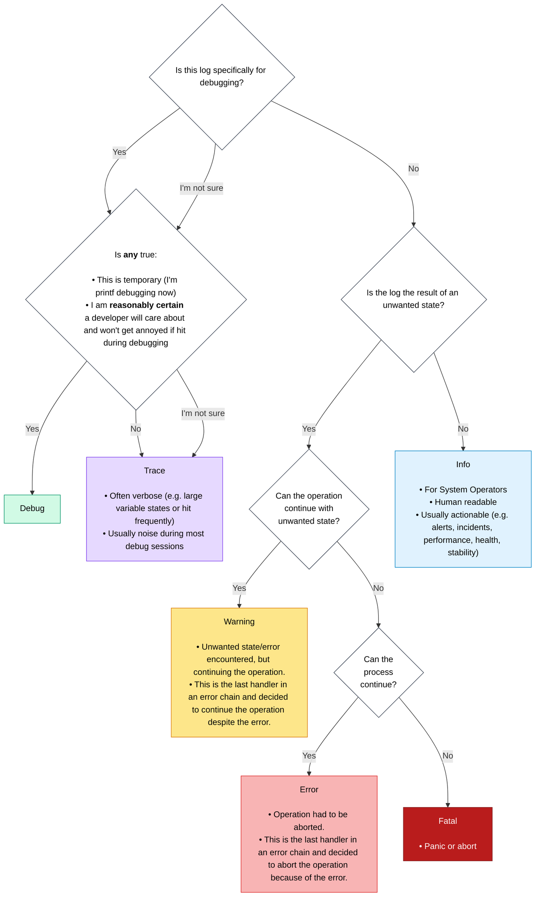

# err_trail

[](https://github.com/mcmah309/err_trail)
[](https://crates.io/crates/err_trail)
[](https://docs.rs/err_trail)
[](https://github.com/mcmah309/err_trail/actions/workflows/ci.yml)

A generic logging interface for libraries and binaries. Libraries remain generic and binaries pick the logging implementation(s). 

Current backends enabled by feature flags: 
- [tracing](https://crates.io/crates/tracing)
- [log](https://crates.io/crates/log)
- [defmt](https://crates.io/crates/defmt) (no_std).

If no backend is selected by the binary, since all operations are inlined, they get compiled away during compilation. No overhead or downstream lock-in. Libraries can also easily enable logs for tests only.

Convenience methods are also added on `Result` and `Option` for ergonomic logging when an `Err` or `None` is encountered. No need to `match` or `inspect`. Similar to how context is handled in libraries like [eros](https://github.com/mcmah309/eros) or [anyhow](https://github.com/dtolnay/anyhow) while moving up the call stack, but for logging.


## In Action

All methods and macros work with the generic backends. Like previously mentioned, if no backend is selected they are compiled away.

### Macros

The `error!`, `warn!`, `info!`, `debug!`, and `trace!` macros use **tracing's
message and field syntax**, including `%` and `?`, across the `tracing`, `log`,
and `defmt` backends.

```rust
use err_trail::{error, warn, info, debug, trace};

fn main() {
    error!("An error occurred: {}", "disk full");
    warn!("This is a warning: {}", "high memory usage");
    info!("Some info: {}", "service started");
    debug!("Debugging value: {:?}", vec![1, 2, 3]);
    trace!("Trace log: {}", "function entered");
}
```

See [Macro format](#macro-format) for examples and supported syntax.

### New Result and Option methods

New methods are added to `Result` and `Option` types - `error`, `warn`, `info`, `debug`, `trace`. These apply logs are various log levels

```rust
use err_trail::ErrContext;

fn main() {
    let value: Result<(), String> = result().error("If `Err`, this message is logged as error");
    let value: Result<(), String> = result().warn("If `Err`, this message is logged as warn");
    // Notice these methods can also accept closures for lazy evaluation
    let value: Result<(), String> = result().error(|err: &String| format!("If `Err`, this message is logged as error: {}", err));
    // If the error type implements `Display` then `()` can be passed to log the error directly if `Err`
    let value: Result<(), String> = result().error(());
}
fn result() -> Result<(), String> { Ok(()) }
```

The same methods exist for `Option` too.

> Note: Due to some limitations of Rust's type inferencing on closures, for closures, usually the input type needs to be specified - e.g. `: &String`.

## Macro format

The syntax in these examples matches `tracing` exactly and works unchanged
with `log` and `defmt`.

Use `{}` to include a value in the message:

```rust
let attempts = 3;
err_trail::info!("Retrying after {} attempts", attempts);
// Retrying after 3 attempts
```

To attach a named value, put `name = value` before the message. If the field
and variable have the same name, you can write just the variable. You can also
leave out the message:

```rust
let attempts = 3u64;

err_trail::warn!(attempts = attempts, "Retrying");
err_trail::warn!(attempts, "Retrying");
// Both calls: Retrying attempts=3

err_trail::info!(attempts);
// attempts=3
```

Numbers, booleans, and strings can be used directly. Use `%` to format a value
with `Display`, or `?` to format it with `Debug`. For strings, the visible
difference is the quotes:

```rust
let error = "connection reset";

err_trail::warn!(%error, "Retrying");
// Retrying error=connection reset

err_trail::warn!(?error, "Retrying");
// Retrying error="connection reset"

err_trail::warn!(reason = %error, "Retrying");
// Retrying reason=connection reset
```

Use `?` for collections or custom types that implement `Debug`. Use `%` for
custom types that implement `Display`, such as an error with a readable
description:

```rust
#[derive(Debug)]
struct Request {
    id: u64,
}

let request = Request { id: 42 };
let delays = [1, 2, 4];

err_trail::debug!(?request, ?delays, "Scheduling retries");
// Scheduling retries request=Request { id: 42 } delays=[1, 2, 4]
```

You can log a struct member directly. You can also choose a dotted field label,
or quote a label that contains punctuation such as a hyphen:

```rust
struct Request {
    id: u64,
}
let request = Request { id: 42 };

err_trail::info!(request.id, "Received request");
// Received request request.id=42

err_trail::warn!(http.status = 503u64, "Request failed");
// Request failed http.status=503
// Here, http.status is a label; no variable named http is needed.

err_trail::info!("request-id" = request.id, "Received request");
// Received request request-id=42
```

Braces can group the fields before the message. They are optional, and trailing
commas are allowed:

```rust
err_trail::warn!(attempts = 3, ready = false, "Retrying");
err_trail::warn!({ attempts = 3, ready = false, }, "Retrying");
// Both calls: Retrying attempts=3 ready=false
```

To choose a logging target, put `target:` first. Supply a string literal or a
constant string expression. `tracing` and `log` use this target for filtering;
`defmt` shows it as a prefix:

```rust
err_trail::warn!(target: "network", attempts = 3, "Retrying");
// log / tracing: Retrying attempts=3 (target: network)
// defmt:         [network] Retrying attempts=3

const TARGET: &str = "network";
err_trail::warn!(target: TARGET, attempts = 3, "Retrying");
// Same target and message as above.
```

`parent:`, `name:`, and constant-expression field names (`{ KEY } = value`)
are not supported.

With a backend enabled, functions used in log arguments run even when their
messages are filtered out. In this code, `build_report()` prints
`Building report` even if debug messages are hidden:

```rust
fn build_report() -> &'static str {
    println!("Building report");
    "report contents"
}

err_trail::debug!("{}", build_report());
```

If no backend feature is selected, `build_report()` is not called.

## Guide

Opinionated guide on how to log if you are new to logging or would like a refresher:


```mermaid
flowchart TD
    Start{Is this log specifically for debugging?}

    Start -->|Yes| SessionType
    Start -->|No| UnwantedState
    Start -->|I'm not sure| SessionType
    SessionType --> |Yes| Debug
    SessionType --> |No| Trace
    SessionType -->|I'm not sure| Trace
    UnwantedState -->|Yes| ProcessContinue
    UnwantedState -->|No| Info    
    ProcessContinue -->|Yes| Warning
    ProcessContinue -->|No| AppContinue 
    AppContinue -->|Yes| Error
    AppContinue -->|No| Fatal

    UnwantedState{Is the log the result of an unwanted state?}
    SessionType{"Is <b>any</b> true:<br/><br/>• This is temporary (I'm printf debugging now)<br/>• I am <b>reasonably certain</b> a developer will care about and won't get annoyed if hit during debugging"}
    ProcessContinue{Can the operation<br/>continue with<br/>unwanted state?}
    AppContinue{Can the<br/>process<br/>continue?}
    
    classDef normal fill:#ffffff,stroke:#374151,color:#000;
    classDef trace  fill:#e6d9ff,stroke:#7c3aed,color:#000;
    classDef debug  fill:#d1fae5,stroke:#059669,color:#000;
    classDef info   fill:#e0f2fe,stroke:#0284c7,color:#000;
    classDef warning fill:#fde68a,stroke:#d97706,color:#000;
    classDef error  fill:#f8b4b4,stroke:#dc2626,color:#000;
    classDef fatal  fill:#b91c1c,stroke:#7f1d1d,color:#fff;

    class Start,SessionType,UnwantedState,ProcessContinue,AppContinue normal;
    class Trace trace;
    class Debug debug;
    class Info info;
    class Warning warning;
    class Error error;
    class Fatal fatal;

    Trace["Trace<br/><br/>• Often verbose (e.g. large variable states or hit frequently)<br/>• Usually noise during most debug sessions"]
    Debug[Debug]
    Info["Info<br/><br/>• For System Operators<br/>• Human readable<br/>• Usually actionable (e.g. alerts, incidents, performance, health, stability)"]
    Warning["Warning<br/><br/>• Unwanted state/error encountered, but continuing the operation.<br/>• This is the last handler in an error chain and decided to continue the operation despite the error."]
    Error["Error<br/><br/>• Operation had to be aborted.<br/>• This is the last handler in an error chain and decided to abort the operation because of the error."]
    Fatal[Fatal<br/><br/>• Panic or abort]
```
> Note: Returning the error to the calling is **not** considered a warning or an error - if anything, a trace.

## no_std

This crate supports `#![no_std]`.
