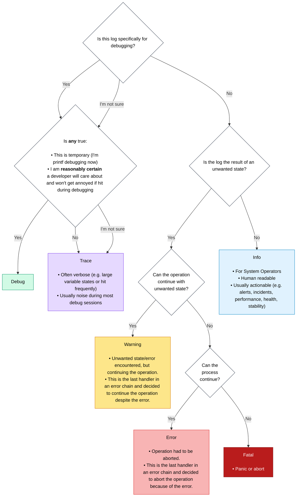

# err_trail

[](https://github.com/mcmah309/err_trail)
[](https://crates.io/crates/err_trail)
[](https://docs.rs/err_trail)
[](https://github.com/mcmah309/err_trail/actions/workflows/ci.yml)

A generic logging interface for libraries and binaries. Libraries remain generic and binaries pick the logging implementation(s). 

Current backends enabled by feature flags: 
- [tracing](https://crates.io/crates/tracing)
- [log](https://crates.io/crates/log)
- [defmt](https://crates.io/crates/defmt) (no_std).

If no backend is selected by the binary, since all operations are inlined, they get compiled away during compilation. No overhead or downstream lock-in. Libraries can also easily enable logs for tests only.

Convenience methods are also added on `Result` and `Option` for ergonomic logging when an `Err` or `None` is encountered. No need to `match` or `inspect`. Similar to how context is handled in libraries like [eros](https://github.com/mcmah309/eros) or [anyhow](https://github.com/dtolnay/anyhow) while moving up the call stack, but for logging.


## In Action

All methods and macros work with the generic backends. Like previously mentioned, if no backend is selected they are compiled away.

### Macros

The `error!`, `warn!`, `info!`, `debug!`, and `trace!` macros use **tracing's
message and field syntax**, including `%` and `?`, across the `tracing`, `log`,
and `defmt` backends.

```rust
use err_trail::{error, warn, info, debug, trace};

fn main() {
    error!("An error occurred: {}", "disk full");
    warn!("This is a warning: {}", "high memory usage");
    info!("Some info: {}", "service started");
    debug!("Debugging value: {:?}", vec![1, 2, 3]);
    trace!("Trace log: {}", "function entered");
}
```

See [Macro format](#macro-format) for examples and supported syntax.

### New Result and Option methods

New methods are added to `Result` and `Option` types - `error`, `warn`, `info`, `debug`, `trace`. These apply logs are various log levels

```rust
use err_trail::ErrContext;

fn main() {
    let value: Result<(), String> = result().error("If `Err`, this message is logged as error");
    let value: Result<(), String> = result().warn("If `Err`, this message is logged as warn");
    // Closures provide lazy evaluation; use `|err: &_|` to infer the error type
    let value: Result<(), String> = result().error(|err: &_| format!("If `Err`, this message is logged as error: {}", err));
    // If the error type implements `Display` then `()` can be passed to log the error directly if `Err`
    let value: Result<(), String> = result().error(());
}
fn result() -> Result<(), String> { Ok(()) }
```

The same methods exist for `Option` too.

> Tip: Use `|err: &_|` for `Result` closures, as shown above. The `_` lets Rust
> infer the error type when formatting it. If you access fields or call methods
> such as `err.len()`, you may need the concrete type, e.g. `|err: &String|`, due
> to a [Rust closure inference limitation](https://github.com/rust-lang/rust/issues/41078).
> `Option` closures take no arguments (`|| ...`) and need no annotation.

## Macro format

The macro syntax matches `tracing` and works unchanged
with `log` and `defmt`. Wherever `err_trail` chooses a text format, we aim to
follow [`tracing-subscriber`'s default `Full` formatter](https://docs.rs/tracing-subscriber/latest/tracing_subscriber/fmt/format/struct.Full.html)
without terminal styling. See [Backend formatting](#backend-formatting) for
output differences and configuration options.

The examples below show the message and fields only, omitting targets,
timestamps, levels, colors, and span context unless stated otherwise.

Use `{}` to include a value in the message:

```rust
let attempts = 3;
err_trail::info!("Retrying after {} attempts", attempts);
// Retrying after 3 attempts
```

To attach a named value, put `name = value` before the message. If the field
and variable have the same name, you can write just the variable. You can also
leave out the message. Message-first ordering, `=`, and spaces between fields
are fixed for `log`/`defmt` and match tracing's default formatter; a tracing
subscriber can choose a different layout:

```rust
let attempts = 3u64;

err_trail::warn!(attempts = attempts, "Retrying");
err_trail::warn!(attempts, "Retrying");
// Both calls: Retrying attempts=3

err_trail::info!(attempts);
// attempts=3
```

Numbers, booleans, and strings can be used directly. Use `%` to format a value
with `Display`, or `?` to format it with `Debug`. These modifiers select the
formatting trait on all backends. For `log`/`defmt`, bare fields also use
`Debug`, and the resulting quoting and escaping are fixed. Tracing retains
native values for bare fields and lets the subscriber control their rendering.
Its default formatter quotes strings like the fallback does:

```rust
let error = "connection reset";

err_trail::warn!(%error, "Retrying");
// Retrying error=connection reset

err_trail::warn!(?error, "Retrying");
// Retrying error="connection reset"

err_trail::warn!(reason = %error, "Retrying");
// Retrying reason=connection reset
```

Use `?` for collections or custom types that implement `Debug`. Use `%` for
custom types that implement `Display`, such as an error with a readable
description:

```rust
#[derive(Debug)]
struct Request {
    id: u64,
}

let request = Request { id: 42 };
let delays = [1, 2, 4];

err_trail::debug!(?request, ?delays, "Scheduling retries");
// Scheduling retries request=Request { id: 42 } delays=[1, 2, 4]
```

You can log a struct member directly, such as `request.id`, or choose a dotted
label such as `http.status`. Quote labels containing punctuation, like
`"request-id"`. Labels display without quotes or a leading `r#`, so `r#type`
appears as `type`. This matches tracing's default formatter and is fixed for
`log`/`defmt`; tracing subscribers can customize it:

```rust
struct Request {
    id: u64,
}
let request = Request { id: 42 };

err_trail::info!(request.id, "Received request");
// Received request request.id=42

err_trail::warn!(http.status = 503u64, "Request failed");
// Request failed http.status=503
// Here, http.status is a label; no variable named http is needed.

err_trail::info!("request-id" = request.id, "Received request");
// Received request request-id=42
```

Braces can group the fields before the message. They are optional, and trailing
commas are allowed:

```rust
err_trail::warn!(attempts = 3, ready = false, "Retrying");
err_trail::warn!({ attempts = 3, ready = false, }, "Retrying");
// Both calls: Retrying attempts=3 ready=false
```

To categorize logs, start the call with `target: "network"` or use a constant
string expression. `tracing`/`log` use it for filtering, with configurable
display. `defmt` adds a fixed `network: ` prefix without affecting filtering.
Without `target:`, no prefix is added to the `log`/`defmt` message.

```rust
err_trail::warn!("Retrying");
// log / defmt message: Retrying
// tracing's default formatter also displays the module path as the target.

err_trail::warn!(target: "network", attempts = 3, "Retrying");
// tracing's default formatter (timestamp and level omitted):
// network: Retrying attempts=3
// defmt message: network: Retrying attempts=3
// log message: Retrying attempts=3; target metadata: "network"

const TARGET: &str = "network";
err_trail::warn!(target: TARGET, attempts = 3, "Retrying");
// Same target and message as above.
```

`tracing` specific parent spans (`parent:`), event names (`name:`), and field labels
taken from constants (`{ KEY } = value`) are not supported. Write field labels
directly, e.g. `request_id = value`. On every backend, `target:` must be a
compile-time string, not a value calculated at runtime.

The `defmt` backend uses Rust formatting through
[`Display2Format`](https://docs.rs/defmt/latest/defmt/struct.Display2Format.html)
to keep the message and field style consistent with the other backends.
Formatting happens on the device, and the formatted content does not use
defmt's native compression. Use standard Rust formatting (`{}`, `{:?}`, `{:x}`)
on every backend. Defmt-specific syntax such as `{=u8}` is not supported.

With a backend enabled, functions used in log arguments run even when their
messages are filtered out. In this code, `build_report()` prints
`Building report` even if debug messages are hidden:

```rust
fn build_report() -> &'static str {
    println!("Building report");
    "report contents"
}

err_trail::debug!("{}", build_report());
```

If no backend feature is selected, `build_report()` is not called.

## Backend formatting

Our default text style is a message followed by space-separated `name=value`
fields, and `target: ` when the target is included in the text.

The backends differ in which parts remain configurable:

| Part of the output | `tracing` | `log` | `defmt` |
| --- | --- | --- | --- |
| Message and field layout: `warn!(attempts = 3, "Retrying")` | Structured fields; the subscriber controls their layout. | Fixed by `err_trail`: message first, then fields in input order. | Same fixed layout as `log`. |
| Field labels, quoting, and separators: `warn!(reason = %error, attempts = 3)` or `warn!(reason = ?error)` | The subscriber controls their rendering. | Fixed by `err_trail` to follow the default tracing field style. | Same fixed rendering as `log`. |
| Target display: `warn!(target: "network", "Retrying")` | Metadata; the subscriber can change its style or hide it. | Metadata; the logger can change its style or hide it. | Fixed `target: ` prefix only for explicit targets; otherwise no added prefix. |
| Timestamps, levels, colors, and source locations: `warn!("Retrying")` selects the level; other metadata needs no macro arguments. | Configured in the subscriber. | Configured in the logger. | Configured in the host-side printer. |

`log` and `defmt` receive fields as message text, so their output configuration
cannot independently rearrange or restyle those fields. `err_trail` exposes no
formatting configuration of its own.

Some values still print differently across backends. Tracing receives the
value as a typed field and can handle its type specially; `log`/`defmt` receive
the text produced by Rust's `Debug` formatting. For example:

| Input (using `err_trail` macros) | Default tracing message and fields | `log`/`defmt` message |
| --- | --- | --- |
| `warn!(attempts = Some(3), "Retrying")` | `Retrying attempts=3` | `Retrying attempts=Some(3)` |
| `warn!(attempts = None::<u32>, "Retrying")` | `Retrying` | `Retrying attempts=None` |
| `warn!(bytes = &[0u8, 1, 255][..])` | `bytes=[00 01 ff]` | `bytes=[0, 1, 255]` |
| `warn!(message = "Retrying")` | `Retrying` | `message="Retrying"` |

Adding `?` explicitly selects Rust's `Debug` representation of the value on
every backend:

```rust
let attempts = Some(3);
err_trail::warn!(?attempts, "Retrying");
// Default tracing and log / defmt message: Retrying attempts=Some(3)
```

`%` similarly selects `Display` for values that implement it. These modifiers
control the value's representation; they do not override a tracing subscriber's
layout or its special treatment of field names such as `message`. For ordinary
message text, use `warn!("Retrying")` rather than `warn!(message = "Retrying")`.
Tracing can also include an error's source chain when it receives an error
object; the `log`/`defmt` fallback uses its Rust formatting instead.

## Guide

Opinionated guide on how to log if you are new to logging or would like a refresher:


```mermaid
flowchart TD
    Start{Is this log specifically for debugging?}

    Start -->|Yes| SessionType
    Start -->|No| UnwantedState
    Start -->|I'm not sure| SessionType
    SessionType --> |Yes| Debug
    SessionType --> |No| Trace
    SessionType -->|I'm not sure| Trace
    UnwantedState -->|Yes| ProcessContinue
    UnwantedState -->|No| Info    
    ProcessContinue -->|Yes| Warning
    ProcessContinue -->|No| AppContinue 
    AppContinue -->|Yes| Error
    AppContinue -->|No| Fatal

    UnwantedState{Is the log the result of an unwanted state?}
    SessionType{"Is <b>any</b> true:<br/><br/>• This is temporary (I'm printf debugging now)<br/>• I am <b>reasonably certain</b> a developer will care about and won't get annoyed if hit during debugging"}
    ProcessContinue{Can the operation<br/>continue with<br/>unwanted state?}
    AppContinue{Can the<br/>process<br/>continue?}
    
    classDef normal fill:#ffffff,stroke:#374151,color:#000;
    classDef trace  fill:#e6d9ff,stroke:#7c3aed,color:#000;
    classDef debug  fill:#d1fae5,stroke:#059669,color:#000;
    classDef info   fill:#e0f2fe,stroke:#0284c7,color:#000;
    classDef warning fill:#fde68a,stroke:#d97706,color:#000;
    classDef error  fill:#f8b4b4,stroke:#dc2626,color:#000;
    classDef fatal  fill:#b91c1c,stroke:#7f1d1d,color:#fff;

    class Start,SessionType,UnwantedState,ProcessContinue,AppContinue normal;
    class Trace trace;
    class Debug debug;
    class Info info;
    class Warning warning;
    class Error error;
    class Fatal fatal;

    Trace["Trace<br/><br/>• Often verbose (e.g. large variable states or hit frequently)<br/>• Usually noise during most debug sessions"]
    Debug[Debug]
    Info["Info<br/><br/>• For System Operators<br/>• Human readable<br/>• Usually actionable (e.g. alerts, incidents, performance, health, stability)"]
    Warning["Warning<br/><br/>• Unwanted state/error encountered, but continuing the operation.<br/>• This is the last handler in an error chain and decided to continue the operation despite the error."]
    Error["Error<br/><br/>• Operation had to be aborted.<br/>• This is the last handler in an error chain and decided to abort the operation because of the error."]
    Fatal[Fatal<br/><br/>• Panic or abort]
```
> Note: Returning the error to the calling is **not** considered a warning or an error - if anything, a trace.

## no_std

This crate supports `#![no_std]`.
